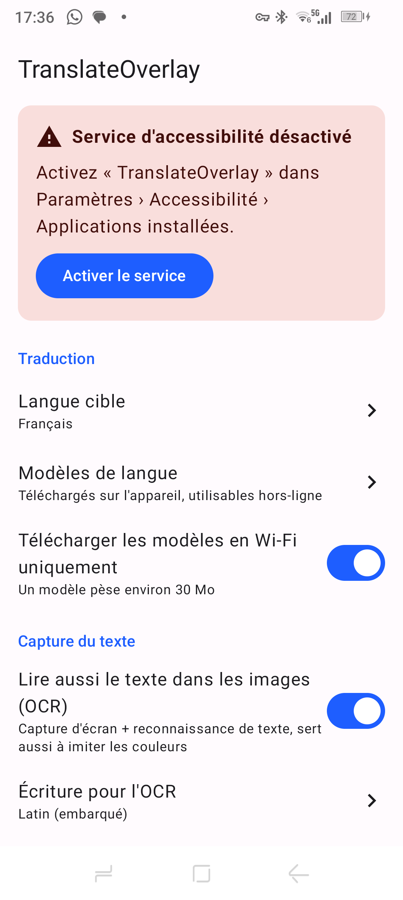
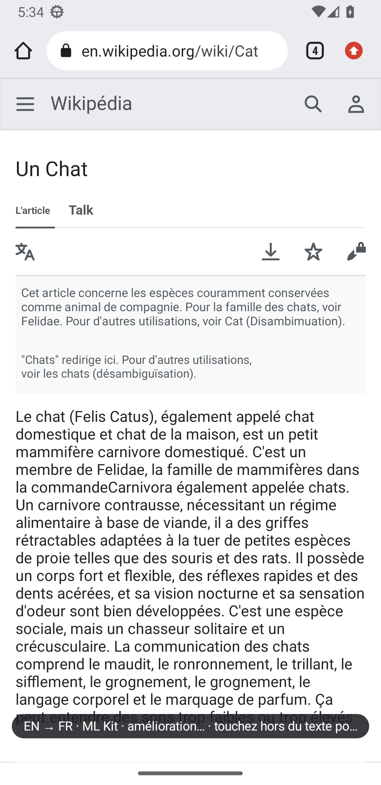
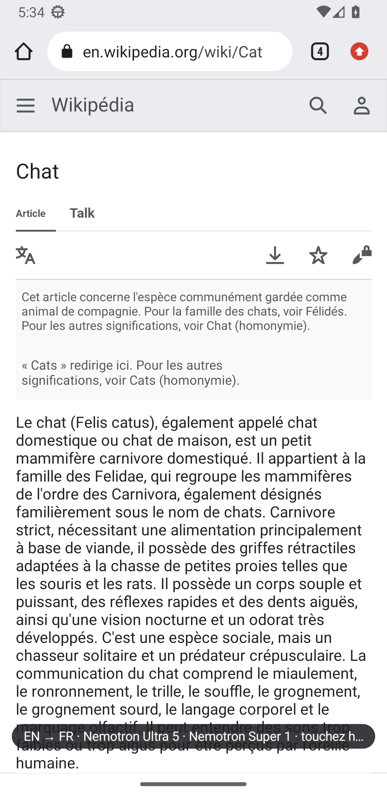

# TranslateOverlay

Bulle flottante Android qui traduit tout le texte visible à l'écran, images comprises, et l'affiche en surimpression à la place de l'original.


[](LICENSE)

## Présentation

Lire une page dans une langue inconnue oblige d'habitude à copier le texte ou à passer par la
traduction propre à chaque application. TranslateOverlay fonctionne **dans n'importe quelle
application** : un appui sur la bulle lit le texte de l'écran (arbre d'accessibilité + OCR des
images), le traduit et le **remplace en surimpression, au même endroit et dans un style proche**
(couleurs, taille, alignement, gras). Langue source détectée automatiquement, langue cible
configurable (français par défaut).

**Statut** : projet personnel actif, version **1.8.1**, build debug validé sur un téléphone réel
(Android 12) et sur émulateur API 33. Pas de publication sur le Play Store à ce jour.

## Fonctionnalités

- Traduction de tout l'écran au tap sur la bulle, dans toute application (hors applications exclues).
- Texte des images lu par OCR sur l'appareil : ML Kit (latin, chinois, japonais, coréen,
  devanagari) et Tesseract embarqué pour l'hébreu, mode « Automatique » multi-alphabet.
- Traduction en ligne **NVIDIA Nemotron 3 Ultra** (secours Nemotron 3 Super) avec **votre** clé
  gratuite, affichée progressivement par-dessus une première traduction hors-ligne **ML Kit**.
  Une seule requête par écran ; sans clé ni réseau, ML Kit seul.
- Imitation du style d'origine ; langues RTL (hébreu) en source comme en cible.
- Pastille d'état indiquant le moteur utilisé, repère par bloc ; toucher un bloc affiche l'original.
- Fermeture automatique de l'overlay quand la page change sous lui (nouvelle URL, défilement).
- Exclusions par application, gestion des modèles de langue, Wi-Fi uniquement, taille/opacité de la bulle.

## Captures d'écran

| Accueil | Traduction hors-ligne (ML Kit) | Traduction améliorée (Nemotron) |
|---|---|---|
|  |  |  |

Autres captures : [docs/screenshots/](docs/screenshots/).

## Prérequis

- **Utilisation** : appareil Android 8.0+ (API 26) ; OCR et imitation des couleurs : Android 11+.
  Architectures `arm64-v8a` / `armeabi-v7a` (et `x86_64` en debug pour l'émulateur).
- **Build** : JDK 17, Android SDK (compileSdk 35), Gradle via le wrapper fourni.
- Facultatif : une clé API NVIDIA (build.nvidia.com, gratuite, sans carte bancaire).

## Installation

1. Construire l'APK (voir [Build](#build)) puis l'installer :
   `adb install app/build/outputs/apk/debug/app-debug.apk`.
2. Ouvrir TranslateOverlay › « Activer le service » → accepter la divulgation → Accessibilité ›
   Applications installées › TranslateOverlay → activer.
3. **Android 13+ avec APK hors Play Store** : si l'option est grisée, Infos de l'appli › menu ⋮ ›
   « Autoriser les paramètres restreints », puis recommencer l'étape 2.

### Permissions

| Permission | Usage |
|---|---|
| Service d'accessibilité | bulle au-dessus des apps, détection de l'app au premier plan (exclusions), lecture du texte et capture d'écran **uniquement au tap sur la bulle** |
| Internet / état réseau | téléchargement des modèles ML Kit (~30 Mo par langue, une fois) et traduction en ligne NVIDIA si une clé est saisie |

Aucune autre permission (ni `SYSTEM_ALERT_WINDOW`, ni MediaProjection, ni accès aux statistiques d'usage).

## Configuration

Tout se règle dans l'application (Paramètres, appui long sur la bulle) : langue cible, applications
exclues, OCR et écriture OCR, modèles téléchargés, Wi-Fi uniquement, taille/opacité de la bulle,
moteur de traduction et clé API, repères par bloc, version.

- **Clé NVIDIA** : créer un compte sur build.nvidia.com, « Get API Key », la coller dans
  Paramètres › Moteur de traduction. Elle est chiffrée sur l'appareil (Android Keystore), jamais
  affichée ni sauvegardée.
- Aucune variable d'environnement ni fichier de configuration n'est nécessaire pour l'application.
  Le banc de mesure `tools/mt-bench` lit sa clé dans un fichier `.env` (variable `NVIDIA_API_KEY`,
  chemin modifiable par `NVIDIA_ENV_FILE`), exclu du dépôt.

## Utilisation

- Toucher la bulle dans n'importe quelle app : l'overlay ML Kit s'affiche aussitôt, puis chaque bloc
  est remplacé dès que la traduction en ligne arrive (mesuré : premier bloc amélioré ~1 s après
  l'overlay).
- Toucher un bloc traduit affiche l'original ; toucher ailleurs ferme l'overlay.
- Appui long sur la bulle : Paramètres.

### Moteur de traduction

- Chaîne : **Nemotron 3 Ultra** (principal) → **Nemotron 3 Super** (secours, une requête groupée
  pour les blocs manquants) → ML Kit reste affiché (erreur, 429, 503, délai, pas de réseau, pas de
  clé). Jamais d'overlay bloqué.
- Limiteur à 20 requêtes/min (l'essai NVIDIA en autorise 40), recul sur 429 (Retry-After), mise en
  pause d'un modèle en échec.
- **Pastille d'état** (à la place de la bulle pendant l'overlay) : bleue qui tourne = amélioration
  en cours, **vert U** = tout en Ultra, **jaune S** = au moins un bloc en Super, **orange K** = au
  moins un bloc resté en ML Kit. Repères par bloc : ● Ultra, ▲ Super, ■ ML Kit, ○ en attente.
- Autres moteurs (code conservé, non recommandés : clé + carte bancaire) : Microsoft Azure
  Translator, Google Cloud Translation.

### Hébreu (et langues RTL)

- **Cible** : choisir « Hébreu » dans Langue cible. L'overlay s'affiche de droite à gauche, aligné en
  miroir de la source, mots latins/chiffres correctement ordonnés, police Noto Sans Hebrew.
- **Source** : le texte des applications est lu directement ; le texte **dans les images** est lu en
  mode OCR « Automatique » (défaut) : les lignes douteuses de l'OCR latin sont relues par Tesseract
  hébreu (ou les modèles CJK/devanagari).

### Diagnostic

`adb logcat -s TO-Diag TranslateOverlay` (build debug) : capture, blocs OCR avec confiance, blocs
absorbés/filtrés, langue détectée et décision par bloc, requêtes en ligne, durées.

## Architecture

```
Bulle (overlay) ──tap──> OverlayAccessibilityService
                           ├─ capture : arbre d'accessibilité + capture d'écran → OCR (ML Kit / Tesseract)
                           ├─ core : fusion des blocs, détection de langue, estimation du style, bidi
                           ├─ translate : ML Kit (immédiat) → Nemotron Ultra → Super (flux, limiteur)
                           └─ overlay : TranslationOverlayView (remplacement + pastille d'état)
```

Technologies : Kotlin, Jetpack Compose (Material 3), coroutines, Google ML Kit (traduction,
identification de langue, reconnaissance de texte), Tesseract4Android, API NVIDIA (compatible
OpenAI), Android Keystore.

```
app/src/main/java/com/translateoverlay/
├── capture/     lecture des nœuds texte, OCR ML Kit et Tesseract
├── core/        logique pure testée (fusion, langue, OCR, style, bidi, péremption, cache)
├── overlay/     bulle, pastille, vue de surimpression
├── pipeline/    orchestration capture → traduction → overlay, journal de diagnostic
├── service/     service d'accessibilité
├── settings/    préférences
├── translate/   moteurs, protocoles en ligne, résilience, stockage chiffré de la clé
└── ui/          écrans Compose (accueil, moteur, apps exclues, modèles)
app/src/debug/   récepteur de test (installation de clé sur émulateur, builds debug uniquement)
app/src/main/assets/tessdata/   modèle Tesseract hébreu embarqué
docs/            étude technique, études moteurs/OCR, captures, pages de test
tools/mt-bench/  bancs de mesure de qualité/latence de traduction (Python)
```

Documentation : [étude technique](docs/PLAN.md), [moteurs de traduction](docs/TRANSLATION_ENGINES.md),
[combinaisons de modèles](docs/TRANSLATION_COMBOS.md), [lecture d'images par modèle vision](docs/VISION_OCR.md).

## Tests

```
JAVA_HOME=<JDK 17> ./gradlew testDebugUnitTest
```

Tests unitaires JVM (JUnit 4, `app/src/test`) de la logique pure : fusion des blocs, jointure du
texte web, détection de langue, logique OCR, estimation du style, bidi, politique de visibilité et
cache, raffinement progressif, péremption de l'overlay, protocoles en ligne (requête unique,
lecture tolérante du flux), résilience (limiteur, recul, disjoncteur). Pas de tests instrumentés :
validation fonctionnelle manuelle sur appareil et émulateur (captures dans `docs/screenshots/`).

## Build

```
JAVA_HOME=<JDK 17> ./gradlew assembleDebug testDebugUnitTest
```

APK produit : `app/build/outputs/apk/debug/app-debug.apk`. Le build release (`assembleRelease`)
n'est pas signé dans le dépôt (keystores exclus par `.gitignore`).

## Versionnage

[SemVer](https://semver.org/lang/fr/) ; historique dans [CHANGELOG.md](CHANGELOG.md)
(format Keep a Changelog). La version est définie dans `app/build.gradle.kts` (`versionName`).

## Feuille de route

Extraits de `TODO_LIST.md` :

- Valider la traduction en ligne sur le téléphone réel avec une clé personnelle (Ultra / Super / repli).
- OCR des gros titres hébreux sur fond coloré dans les images ; OCR multi-écriture simultané.
- Taille de police exacte des nœuds (API 30), mode « live » (retraduction au défilement).
- Moteur hors-ligne de meilleure qualité (Opus-MT / NLLB sur l'appareil).
- Tests instrumentés et préparation Play Store (déclaration Accessibility API).

## Sécurité

- Signaler une vulnérabilité en privé via GitHub (Security › Report a vulnerability), pas d'issue publique.
- Aucun secret dans le dépôt : la clé API est saisie dans l'application et chiffrée par Android
  Keystore ; `.env`, keystores et fichiers de signature sont exclus par `.gitignore`.
- Le service d'accessibilité ne lit l'écran **qu'au tap sur la bulle**. Le texte de l'écran est
  envoyé à l'API NVIDIA uniquement si une clé est configurée ; sinon tout reste sur l'appareil.
  Exclure les applications sensibles (banque, messagerie) dans Paramètres › Applications exclues.

## Contribution

Projet personnel ; pas de contribution externe attendue. Pour toute modification :
tests unitaires verts, entrée dans le CHANGELOG et bump de version.

## Licence

[MIT](LICENSE) © 2026 Stéphane Hercot.

## Auteur

StephaneHe (GitHub).
